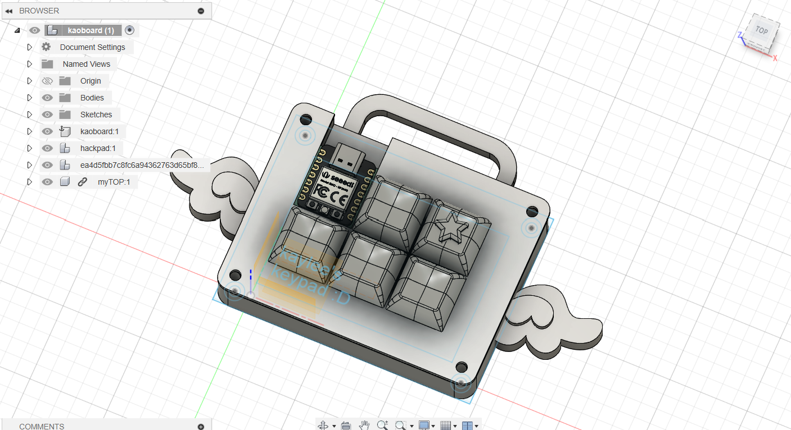
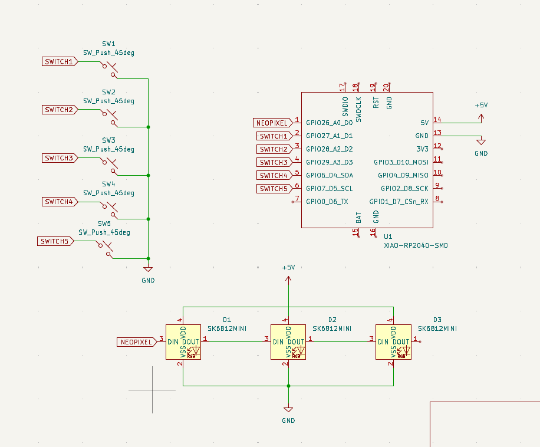
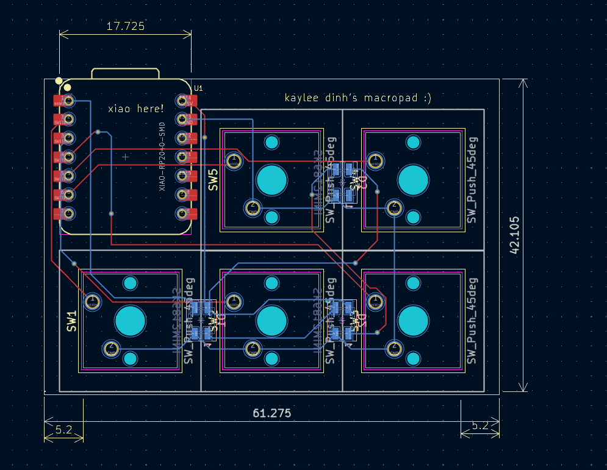
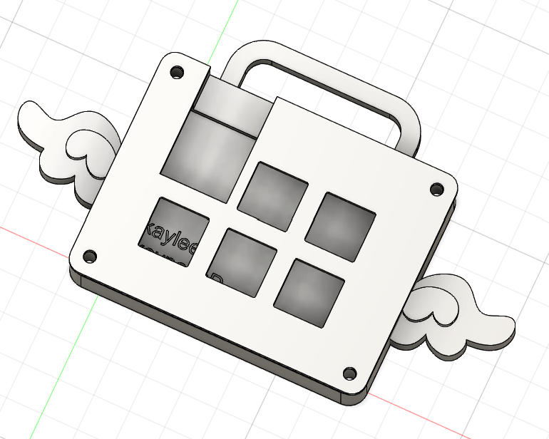

# kaylzpad
This is an angel-shaped keypad that I made for Highway to Undercity (Hackpad)!

## Schematic

## PCB

## Model

## BOM
- 5x Cherry MX Switches
- 5x DSA keycaps
- 4x M3x5x4 heatset inserts
- 4x M3x16mm screws
- 3x SK6812 MINI-E LEDs
- 1x XIAO RP2040
- 1x 3D printed case (2 components)
